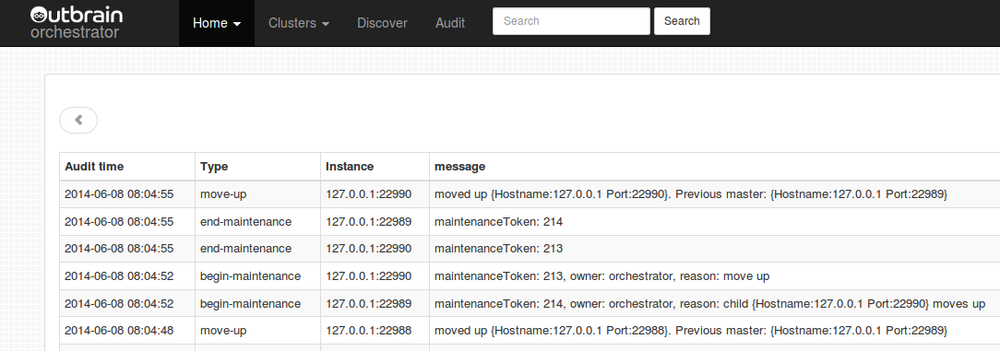

# Using the Web interface

The following assumes you have [Executed as web/API service](#executing-as-webapi-service).
Open your browser and direct it at `http://your.host:3000`. If all went well, you should see
the following welcome page:

If this is your first time using _orchstrator_, then you should begin by teaching it.
`orchestrator` needs to know what replication topologies you have. The web interface
provides this via the `discover` page.

From each replication topology, pick one server (this could be master or slave) and let
`orchestrator` know which hostname & port this server listens on. `Orchestrator` will
recursively drill up and down replication to map the entire topology. This may take a couple
minutes, during which `orchestrator` connects the servers it encounters into sub-topologies and
eventually into the final topology.

You may manually enter as many servers as you like (inside or outside the topology).
The first time `orchestrator` investigates, it can only reach those replicas that are
_currently replicating_. So if you know you have some slves which are temporarily down, you'll need
to add them manually, or, if you like to see automation in work, just wait until they're up, at which
time `orchestrator` will automaticaly find them.

> Once `orchestrator` is familiar with a server, it doesn't care if the server is lagging, not replicating
> or inaccessible. The server is still part of the topology it was last seen in. There is a timeout for
> that: if a server is not seen by `UnseenInstanceForgetHours` hours, it is automaticaaly forgotten
> (presumed dead). Again, if it suddenly comes back to life, and connects to a known topology, it is
> automatically re-discovered.

`Orchestrator` resolves the `CNAME` of every input it gets, either from the user or from the replication
topology itself. This is for avoiding ambiguities or implicit duplicates.

Once `orchestrator` is familiar with a topology, you can view and manipulate it via the `cluster` page.
Click the `clusters` drop down on navigation bar to see available clusters.

> Each topology is associated with a _cluster name_, which is (currently) named after the topology's master.

The `cluster` page is where most fun happens. `Orchestrator` presents the cluster in an easy to follow
tree infographic, based on a D3 widget. Sub trees are collapsible.

Each node in the tree presents a single MySQL instance, listing its fully qualified name, its version,
binary log format and replication lag.

Note that each server has a _settings_ icon to the right. Clicking this icon opens a modal with some
extra info on that server as well as operations to be performed.

The modal allows you to begin/terminate maintenance mode on an instance; perform an immediate refresh
(by default instances are polled once per minute - this is configurable); stop/start replication; forget
the instance (may be rediscovered a minute later if still connected to the topology).

The topology can be refactored: replicas can be moved around via _drag and drop_. Start dragging an instance:
all possible _droppable_ targets are immediately colored green. You may turn your instance to be the slave of
all _droppable_ targets.

Master-master topologies can be created by dragging a _master_ onto one of its slaves, making both co-masters.

Complex refactoring is done by performing multiple such steps. You may need to drag and drop your
instance three or four times to put it in a "remote" location.

`Orchestrator` will keep you safe by disallowing dropping your instance when either your instance or its
target master have problems (lag too much, do not replicate etc.). It may allow the drop and still abort
the operation if it finds a deeper block, such as the target not having binary logs.

Begin dragging: possible targets colored green

Move over your target and drop:

Topology refactored:

Dragging a master over its slave makes for a co-masters (master-master) topology:

A co-master topology:

`Orchestrator` visually indicates replication & accessibility related problems: slave lag, replication not working,
instance not accessed for long time, instance access failure, instance under maintenance.

_Problems_ drop down is available on all pages, and indicates all currently known issues across all topologies:

The `Audit` page presents with all actions taken via `orchestrator`: slave move, detection, maintenance etc.
(`START SLAVE` and `STOP SLAVE` are currently not audited).

`Queries` -> `Long queries` page list last met long running queries over the entire topology. these would be
queries running over `60` seconds, non-replication, non-event-scheduler.
